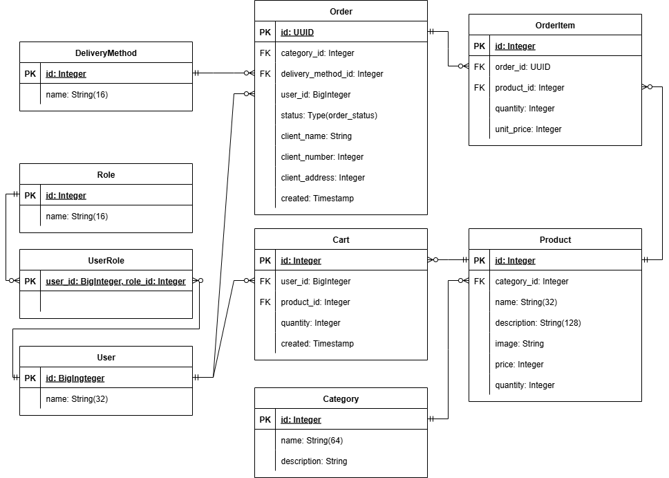

# Aiogram shop bot
___
## About architecture
The project consists of several layer:
- application 
- presentation (src/bot)
- infrastructure 
___

### Application layer
This layer is independent of other layers. It provides interfaces for executing application usecases and coordinating work between components through abstractions, operating only on data schemas.

Contains **UseCases**, **Ports** (interfaces), **Schemas**(pydantic DTO)
___

### Presentation layer
This layer is the external interface of the application. 
It is responsible for processing user requests and returning responses. 
Works only with abstractions: calls service ports/interfaces and/or use case objects from the application layer; 
specific implementations are substituted by the **dishka** ioc container, so the presentation is unaware of them and does not depend on them.


Contains **Handlers**, **Filters**, **Middlewares**
___

### Infrastructure layer
Implements specific port implementations (repositories/services) and integrations with databases/cache/external APIs, maps ORM data to application.schemas, configures DI (providers, ioc container). Depends on the application (ports, schemas, enums/exceptions).

Contains **Service implementation**, **Repository implementation**, **Dishka DI**, **DB Models**
___

## DataBase Schema

<p align="center">
    
</p>

___

## Easy start with Docker
Clone the repository

```bash
git clone https://github.com/Sergey-sply/shop_bot.git
```
___

Go to the app dir and configure env file
1. Copy file `.env.example` and rename it to .env
2. Open it and configure it
___

Then make migrations
```commandline
docker compose run --rm migrate
```
___

And run docker-compose
```commandline
docker compose up --build -d
```
